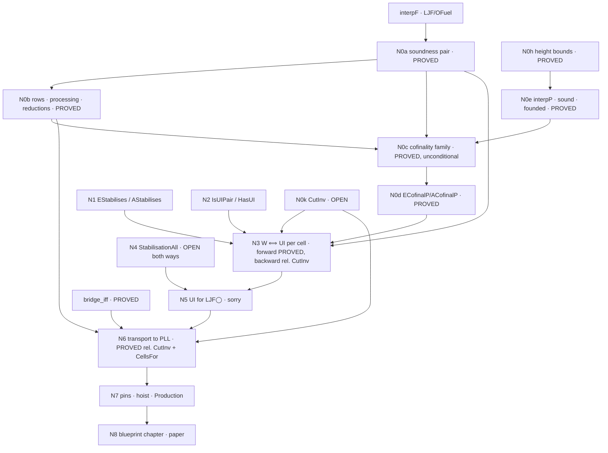

# Route (B) blueprint — uniform interpolation for PLL via the fuel-founded retention interpolant

Drafted 2026-09-05 (Matthew's direction: state the nodes now, with `sorry`
bodies as work in progress, and make the plan a document others can work
from).  Lean source of the nodes: `wip/ui_routeB_blueprint.lean`
(Experimental library only; every `sorry` there is a node to fill, never a
claim).  Evidence base: `docs/ui-ljfo-clause-table.md` §4.7–4.12.

## 0 · How to read and use this

* A **node** is one Lean declaration.  Its **status** is one of
  PROVED (sorry-free, axioms pinned with `#axioms_within`), IN BUILD (an
  agent is producing it now), DRAFTED (statement typed, body `sorry`),
  OPEN (no proof attempted; may be true or false), REFUTED (kernel-checked
  counterexample).  Only PROVED is a result.
* **Edges** are "depends on".  Work on a node only when its inputs are
  PROVED or explicitly assumed as typed hypotheses (the `CimpAnt` idiom:
  `def X : Type := ∀ …` passed as an argument, never a `sorry` in a shared
  module).
* **Sorries live in `wip/` only.**  `lake build Experimental` allows
  `sorryAx`; `lake build Production` forbids it and is the admission gate.
  A node is hoisted out of `wip/` into `LJF/` when its `sorry` is gone
  and its pin holds.
* **Method** (repo `METHOD.md`, `CLAUDE.md`): formal statement first;
  refute before building (the harness of §4.12 is the screen); watch every
  gate fail once; standard proof-theoretic language.
* **Repo mechanics**: work in a worktree; never push `claude/*` branches;
  `scripts/campaign-push.sh frjw-dev` is the only push; `TOOLS.md` before
  reaching for a tool; commit trailers as in `CLAUDE.md`.

## 1 · The aim, in one line

For every PLL formula φ and variable p there are p-free `∃p.φ` and `∀p.φ`
(uniform interpolation, Pitts's sense).  The route: LJF◯'s fuel-founded
retention interpolant `interpF` computes chains `E_f` (descending from ⊤)
and `A_f` (ascending from ⊥); soundness at every fuel is PROVED; cofinality
(every sufficient p-free formula is reached at some fuel) is BUILT on the parking definition `interpP` conditional on ONE antecedent dispatch, `ParkAntP`, a fixpoint that the re-founding on `μ = (hgt, weight, size)` discharges (§4.15–4.16; the Dyckhoff-row defect is fixed);
with both, **UI at a cell ⟺ the chains stabilise**; stabilisation at every
cell is THE open theorem; the bridge transports LJF◯ to PLL.

## 2 · Nodes

| id | declaration | file | status | depends on |
|---|---|---|---|---|
| N0a | `eSoundF`, `aSoundF` — soundness at every fuel | `LJF/OFuelSound.lean` | **PROVED** `[propext, Quot.sound]` | `interpF` |
| N0b | row equations at fuel; processing phase `eMinFF`/`aMinFF`; reductions `ecofinalF_of_satE2F`, `acofinalF_of_satA2F`; `cimpAntF_of_satA2F` | `LJF/OFuelMin.lean` | **PROVED** | N0a |
| N0h | height bounds of every derivation transformer (the Step-0 table); `laxReleaseUp`/`laxReleaseCirc` | `LJF/OFuelHeight.lean` | **PROVED** (873 lines, pinned) | — |
| N0e | `interpP`, the parking definition; `eSoundP`/`aSoundP`; rows, processing phase `eMinPP`/`aMinPP`, reductions; the founding `μ = (hgt, weight)` with every edge class discharged (Part 10); `parkAntP_of_satA2P`; `parkFireE` | `LJF/OFuelP.lean`, `OFuelPSound.lean`, `OFuelPMin.lean`, `OFuelPCof.lean`, `OFuelHeight.lean` Part 10 | **PROVED** — soundness `[propext, Quot.sound]`, kernel-checked agreement with `interpF` off the changed shapes, founding proved (§4.14) | N0h |
| N0c | `tinvP`, `uentryP`, `parkAntP`, `satE2P`, `satA2P` — the 17-definition family in fuel-carrying form over `interpP`, ONE `mutual` on `μ = (hgt, weight, sizeOf)` | `LJF/OFuelPFamKit.lean`, `LJF/OFuelPFam.lean`, `LJF/OFuelPCofinal.lean` | **PROVED, UNCONDITIONAL** `[propext, Classical.choice, Quot.sound]` (§4.17). The antecedent guard is a native recursive call at all twenty parked arms; `ParkAntP` is a consequence, not a hypothesis. `DykAntP` WITHDRAWN 2026-09-05 (§4.15–4.16) | N0e |
| N0d | `ECofinalP`, `ACofinalP` and their inhabitants `ecofinalP`, `acofinalP`; `ECofinalF`/`ACofinalF` and the upward-closed forms `ECofinalUp`, `ACofinalUp` | `LJF/OFuelPCofinal.lean`, `wip/ui_routeB_statements.lean`, `wip/ui_routeB_blueprint.lean` | **PROVED** for `interpP` `[propext, Classical.choice, Quot.sound]` (§4.17); the `interpF` forms remain DRAFTED | N0c |
| N1 | `EStabEq`, `AStabEq` — the chains LITERALLY constant from some fuel (`∀ f ≥ f₀, E_f = E_{f₀}`); `EStabilises`, `AStabilises` the interderivable forms, derived from them | `wip/ui_routeB_n3.lean` | **STATED**, `estabilises_of_stabEq`/`astabilises_of_stabEq` PROVED `[propext, Quot.sound]` (§4.19) | — |
| N2 | `IsUIPair`, `HasUI` — Pitts's pair for a cell, intrinsic (`minE` at every judgment `j`; `minA` at `tru`, the lax cell being the cell `done ⇒ ◯P`) | `wip/ui_routeB_n3.lean` | **STATED** (axiom-free) | — |
| N3 | `hasUI_of_stabEq` (forward), `stabilises_of_hasUI` (backward) — W ⟺ UI per cell | `wip/ui_routeB_n3.lean` | **forward PROVED** `[propext, Quot.sound]`, no cut, over `SatE2P`/`SatA2P` as variables; **backward PROVED relative to `CutInv`** (§4.19) | N0e, N0d, N1, N2 |
| N4 | `StabilisationAll` — every saturated cell stabilises | same | **OPEN both ways** (`sorry` placeholder) | — |
| N5 | `ljfo_ui_of_stabilisation` — UI for LJF◯ | same | DRAFTED (`sorry`) | N3, N4 |
| N6 | `IsUIPairPLL`, `PLL_UI`, `pll_ui_of_ljfo : CutInv → (∀ p, CellsFor p) → PLL_UI` — transport to PLL; `pfree_roundTripN` proved | `wip/ui_routeB_n3.lean` | **PROVED relative to `CutInv` and `CellsFor`** `[propext, Quot.sound]` (§4.19) | `bridge_iff`, N3 |
| N0k | `CutInv` — composition of `Inv` derivations: `Γ ⊢ N → N :: Δ ⊢ⱼ ψ → Γ ++ Δ ⊢ⱼ ψ`. Reduces through the bridge to completeness at every polarisation, restated after the refutation stage as `PolInvT` (judgment `tru`) + `PolInvL` (`lax`, shifted goals `↑P` only): `PolInv` at `lax` for unshifted `⊃`/`∧` goals is REFUTED (no rule concludes them; certified) but that case is vacuous for `CutInv` | `wip/ui_routeB_n3.lean`, `wip/cutinv_cells.lean`, `docs/cutinv-cases.md` | **OPEN**; refutation stage DONE (§4.21): 14 steps from the completeness proof, 26 designed cells all PASS at `[]`, the ◯-free block (17 cells) a result in its own right; route (a) recommended with an 8-lemma transfer block | — |
| N0i | `FuelIrrelevance` — one fuel step without change at a station implies the chain is constant above it | `wip/ui_routeB_n3.lean` | **OPEN** (typed obligation; on N4's path, not N3's) | — |
| N7 | pins, hoist out of `wip/`, `Production` sweep, `TOOLS.md` | — | — | each node as it lands |
| N8 | blueprint chapter (`LaxBlueprint/`), HANDOFF entry, paper | — | — | N7 |

### The statements (as in the Lean)

    EStabilises p done  :=  Σ f₀, ∀ f ≥ f₀,  E_{f₀} ⊢ E_f  ×  E_f ⊢ E_{f₀}
    AStabilises p done G := Σ f₀, ∀ f ≥ f₀,  E_f, A_{f₀} ⊢ A_f  ×  E_f, A_f ⊢ A_{f₀}

    IsUIPair p done G E A :=
      E, A p-free;  Γ ⊢ E;  (Δ, Γ ⊢ ψ → Δ, E ⊢ ψ)  for p-free Δ, ψ;
      A, Γ ⊢ G;     (Δ, Γ ⊢ G → Δ, E ⊢ A)          for p-free Δ

    N3:  EStabilises × AStabilises  ⟺  HasUI       (given N0a and N0d)
    N4:  ∀ done G, Saturated done → ParkedCtx done → EStabilises × AStabilises
    N6:  PLL_UI := ∀ p φ, Σ E A, IsUIPairPLL p φ E A

`E_f := interpF p f [] done none`, `A_f := interpF p f [] done (some G)`;
`Γ` is the saturated station `done`; goal judgment `tru` (the `lax` case
through `jGoal`).

## 3 · Dependency graph

## 4 · Work packages

**WP1 — N0c and N0d on `interpP`: DONE, UNCONDITIONAL (§4.15–4.17).**
**WP1a — DONE 2026-09-05** (36 min, merged 392949b): the Dyckhoff row
guarded at the antecedent's own goal (14 sites, two of them a second
copy of the row spec in `OFuelPFam` Part 3), soundness re-proved first
at `[propext, Quot.sound]`, the negative control on
`[↓(c ⊃ ↑a) ⊃ ↑e]` by `rfl`, `DykAntP` withdrawn, no measure work.
**WP1b — DONE 2026-09-05** (§4.17): the family re-founded on
`μ = (hgt, station weight, sizeOf)`, the guard native at all twenty
parked arms, the two `mutual` blocks merged into one of seventeen
definitions (the `∀p` side calls `TStabQ`, so they were separable only
while the guard was a parameter).  Two additions Part 10 does not carry:
the six `p`-eliminators measure `hgt(recursion argument) + hgtL lfP`,
and `stabAtomCast` makes the refired atom's cast a rewrite.  The
termination kit is split into `LJF/OFuelPFamKit.lean` with
`wip/hgt_probe.lean` as its 3.7-second bench.
`ecofinalP`/`acofinalP` are in `LJF/OFuelPCofinal.lean`, unconditional.
**Verified in the session worktree 18:43** (build exit 0, pins measured,
gate watched failing, sorry sweep clean; §4.17).
**WP1c — the budget refactor: premise REFUTED (§4.20).**  Measured:
bodies 3 s; `WellFounded.fix` elaboration ~507 s; kernel check of the
packed term ~950 s.  Budgets under `termination_by` are slower; not
installed.  `Classical.choice` comes from `atomMem_of_mem` (a string-
order proof in `LJF/O.lean`), not from the recursion.  Recorded design
for seconds-scale elaboration: no `WellFounded.fix` — `Nat.rec` on a
height budget, `Nat.rec` on a station budget, structural recursion on
the derivation; possible because every ∃p/∀p edge is height-strict.
Do after review themes 1–2 halve the block.  N3 (WP2) did not need to
unfold the family after all: it takes `SatE2P`/`SatA2P` as variables.
**Bundled with it (WP1d, scheduled 2026-09-06 01:05, proposal relayed
from Matthew by the blueprint session): reprove `atomMem_of_mem` in
`LJF/O.lean` choice-free.**  Its trailing bare `simp` closes
`(a == a) = true` on `String` through the order's antisymmetry
(`String.le_antisymm` → `Classical.propDecidable`); closing it by
decidable equality removes the only `Classical.choice` in the route-(B)
chain, so N0c, N0d and everything downstream drop to
`[propext, Quot.sound]`.  Buys nothing for build time; it rides on the
structural refounding's one family rebuild so the 25-minute pin sweep is
paid once, not twice.

**WP2 — N3.**  Forward: instantiate N0a at the stabilised fuel, minimality
from N0d read at that fuel.  Backward: N0d applied to `E` and to `A`
gives a fuel from which `E_f ⟛ E` and `E_f ∧ A_f ⟛ E_f ∧ A`; needs the
upward-closed form (that is why `UpFrom` was chosen).  Days.

**WP3 — N4, the theorem.**  Proof prong: bound the fuel a cell needs
uniformly over Δ by loop-elimination over the finite state space of
(station, goal) pairs the recursion visits (stations as sets), in the
style of the decider's height bounds (`PLLG4Dec`, the FRJW dichotomy).
The measured constraint: a consequence enters the chain about three times
its derivation height later, one parked-box nesting level per ~10 fuel
units (§4.12).  Refutation prong: a cell whose A-chain ascends without
bound (the Ghilardi–Zawadowski shape); the screen of §4.12 is the harness
(instance screen → chain probe → cofinality instances by the focused
kernel search), and a non-stabilising cell is, with N3, a proof that PLL
lacks UI.  Both outcomes are results.  Unknown duration; the core.

**WP4 — N6.**  Polarise (`negOfO`), take the cell interpolants (E-side of
the station `[negOfO φ]` after processing by `eMinFF`; A-side of the cell
`[] ⇒ negOfO φ`), erase (`eraseNeg`); minimality transports through
`bridge_iff` both ways.  Days.

**WP6 — `CutInv` by route (a).**  Refutation stage done (§4.21,
`docs/cutinv-cases.md`).  Build: the eight transfer lemmas between `N`
and its canonical form `⟦N⟧ = negOfO (eraseNeg N)` (goal, hypothesis,
pending positive, focused positive, each way) in one mutual block on the
formula, the delay cases exactly as the cells do them; `laxAdm`; then
`PolInvT`/`PolInvL` from `FocalizationPLL`, and `CutInv` by erase,
compose, re-focalise.  ◯-free steps first (rule 8).

**WP5 — N7/N8.**  Pins (`#axioms_within`, measured sets), hoist from
`wip/` into `LJF/`, `lake build Production` clean, `TOOLS.md` cells,
HANDOFF §, blueprint chapter, paper.  Ongoing.

## 5 · Evidence that shaped the statements (2026-09-04/05)

* The two earlier "GZ" cells are instance-closed (`∀p` = an instance
  `Γ[χ] ⊃ G[χ]`, χ = ⊥ and χ = s); cofinality validated at both.
  **Certified in the kernel** (`LaxLogic/PLLInstanceBound.lean`,
  2026-09-05): the instance bound `instanceBound` (Δ p-free, Δ, Γ ⊢ G ⟹
  Δ ⊢ Γ[χ] ⊃ G[χ], by `substND`), instance closure `instanceClosed`
  (a sufficient instance bound is the weakest sufficient p-free formula,
  `IsWeakestSufficient`), and the two cells `cell1_forall_p`,
  `cell2_forall_p`, all `[propext, Quot.sound]`; the two sufficiency
  derivations are axiom-free closed terms.  This is the screening
  principle of §4.10 as a theorem, usable on any future candidate.
* S1 = `[◯(d ⊃ p) ⊃ a, c ⊃ ◯p] ⇒ a` is the first cell no instance closes;
  cofinality validated for Δ = c at station fuel 14 (both sides, also at
  S6 with a Dyckhoff hypothesis and at S7) and for Δ = ◯(c ∨ ¬d) at
  station fuel 22 — each at the fuel the row analysis predicted.  The
  A-side instance for the conjectured `∀p` is a frontier marker (the goal
  outgrows the search), not a failure.
* The first cofinality build stopped at the founding (a cycle at a fixed
  station, §4.11); the height-first order is the one that survives.
* Filter for any refutation candidate: no sufficient p-free instance;
  screen by oracle before measuring a chain.

## 6 · Pointers

`frjw-dev`: 40446bc (family merged) and after.  Files:
`LJF/OFuel.lean`, `LJF/OFuelSound.lean`, `LJF/OFuelMin.lean`,
`LJF/OFuelP.lean`, `LJF/OFuelPSound.lean`, `LJF/OFuelPMin.lean`,
`LJF/OFuelPCof.lean`, `LJF/OFuelPFamKit.lean`, `LJF/OFuelPFam.lean`,
`LJF/OFuelPCofinal.lean`, `LJF/OFuelHeight.lean`, `wip/hgt_probe.lean`,
`LaxLogic/PLLInstanceBound.lean`,
`wip/ui_routeB_statements.lean`, `wip/ui_routeB_blueprint.lean`,
`wip/ui_retention_cell.lean`, `wip/ui_interpFS.lean`,
`wip/ui_interpFS_run.lean` (`lake exe uifs`), `wip/ui_screen/`.
Record: `docs/ui-ljfo-clause-table.md`, `docs/ljfo-plan.md`,
`docs/next-session.md`.
