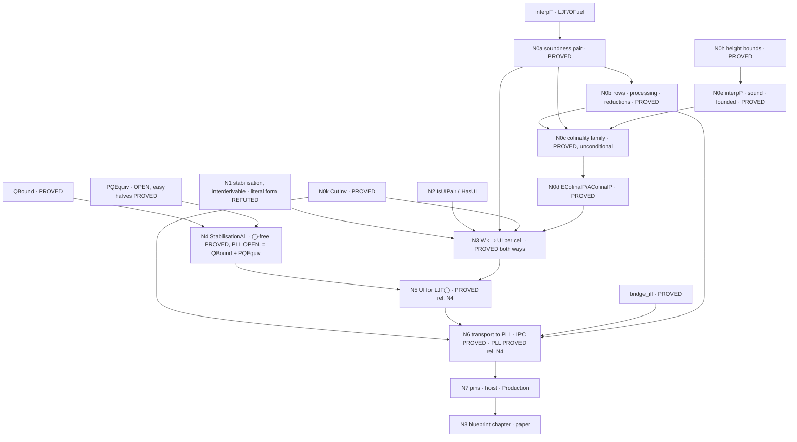

# Route (B) blueprint — uniform interpolation for PLL via the fuel-founded retention interpolant

Drafted 2026-09-05 (Matthew's direction: state the nodes now, with `sorry`
bodies as work in progress, and make the plan a document others can work
from).  Lean source of the nodes: `wip/ui_routeB_blueprint.lean`
(Experimental library only; every `sorry` there is a node to fill, never a
claim).  Evidence base: `docs/ui-ljfo-clause-table.md` §4.7–4.12.

## 0 · How to read and use this

* A **node** is one Lean declaration.  Its **status** is one of
  PROVED (sorry-free, axioms pinned with `#axioms_within`), IN BUILD (an
  agent is producing it now), DRAFTED (statement typed, body `sorry`),
  OPEN (no proof attempted; may be true or false), REFUTED (kernel-checked
  counterexample).  Only PROVED is a result.
* **Edges** are "depends on".  Work on a node only when its inputs are
  PROVED or explicitly assumed as typed hypotheses (the `CimpAnt` idiom:
  `def X : Type := ∀ …` passed as an argument, never a `sorry` in a shared
  module).
* **Sorries live in `wip/` only.**  `lake build Experimental` allows
  `sorryAx`; `lake build Production` forbids it and is the admission gate.
  A node is hoisted out of `wip/` into `LJF/` when its `sorry` is gone
  and its pin holds.
* **Method** (repo `METHOD.md`, `CLAUDE.md`): formal statement first;
  refute before building (the harness of §4.12 is the screen); watch every
  gate fail once; standard proof-theoretic language.
* **Repo mechanics**: work in a worktree; never push `claude/*` branches;
  `scripts/campaign-push.sh frjw-dev` is the only push; `TOOLS.md` before
  reaching for a tool; commit trailers as in `CLAUDE.md`.

## 1 · The aim, in one line

For every PLL formula φ and variable p there are p-free `∃p.φ` and `∀p.φ`
(uniform interpolation, Pitts's sense).  The route: LJF◯'s fuel-founded
retention interpolant `interpF` computes chains `E_f` (descending from ⊤)
and `A_f` (ascending from ⊥); soundness at every fuel is PROVED; cofinality
(every sufficient p-free formula is reached at some fuel) is PROVED,
unconditionally, on the parking definition `interpP` (§4.17);
with both, **UI at a cell ⟺ the chains stabilise** (N3, PROVED both ways);
stabilisation at every saturated station (N4) is THE open theorem, PROVED
on ◯-free stations; the transport to PLL is PROVED (§4.24): `PLL_UI`
rests on N4 alone, and holds outright on IPC formulas, where route (B)'s
interpolants agree with Pitts's.

## 2 · Nodes

| id | declaration | file | status | depends on |
|---|---|---|---|---|
| N0a | `eSoundF`, `aSoundF` — soundness at every fuel | `LJF/OFuelSound.lean` | **PROVED** `[propext, Quot.sound]` | `interpF` |
| N0b | row equations at fuel; processing phase `eMinFF`/`aMinFF`; reductions `ecofinalF_of_satE2F`, `acofinalF_of_satA2F`; `cimpAntF_of_satA2F` | `LJF/OFuelMin.lean` | **PROVED** | N0a |
| N0h | height bounds of every derivation transformer (the Step-0 table); `laxReleaseUp`/`laxReleaseCirc` | `LJF/OFuelHeight.lean` | **PROVED** (873 lines, pinned) | — |
| N0e | `interpP`, the parking definition; `eSoundP`/`aSoundP`; rows, processing phase `eMinPP`/`aMinPP`, reductions; the founding `μ = (hgt, weight)` with every edge class discharged (Part 10); `parkAntP_of_satA2P`; `parkFireE` | `LJF/OFuelP.lean`, `OFuelPSound.lean`, `OFuelPMin.lean`, `OFuelPCof.lean`, `OFuelHeight.lean` Part 10 | **PROVED** — soundness `[propext, Quot.sound]`, kernel-checked agreement with `interpF` off the changed shapes, founding proved (§4.14) | N0h |
| N0c | `tinvP`, `uentryP`, `parkAntP`, `satE2P`, `satA2P` — the 17-definition family in fuel-carrying form over `interpP`, ONE `mutual` on `μ = (hgt, weight, sizeOf)` | `LJF/OFuelPFamKit.lean`, `LJF/OFuelPFam.lean`, `LJF/OFuelPCofinal.lean` | **PROVED, UNCONDITIONAL** `[propext, Classical.choice, Quot.sound]` (§4.17). The antecedent guard is a native recursive call at all twenty parked arms; `ParkAntP` is a consequence, not a hypothesis. `DykAntP` WITHDRAWN 2026-09-05 (§4.15–4.16) | N0e |
| N0d | `ECofinalP`, `ACofinalP` and their inhabitants `ecofinalP`, `acofinalP`; `ECofinalF`/`ACofinalF` and the upward-closed forms `ECofinalUp`, `ACofinalUp` | `LJF/OFuelPCofinal.lean`, `wip/ui_routeB_statements.lean`, `wip/ui_routeB_blueprint.lean` | **PROVED** for `interpP` `[propext, Classical.choice, Quot.sound]` (§4.17); the `interpF` forms remain DRAFTED | N0c |
| N1 | `EStabilises`, `AStabilises` — the chains eventually constant up to interderivability, the A-side modulo `E_f`. The LITERAL forms `EStabEq`/`AStabEq` are REFUTED at every saturated station with a parked compound implication (six designed cells, kernel-checked; the self-referential attack row) | `wip/ui_routeB_n3.lean`, `wip/ui_routeB_n4_lit.lean` | **STATED**; literal forms **REFUTED** (§4.23) | — |
| N2 | `IsUIPair`, `HasUI` — Pitts's pair for a cell, intrinsic (`minE` at every judgment `j`; `minA` at `tru`, the lax cell being the cell `done ⇒ ◯P`) | `wip/ui_routeB_n3.lean` | **STATED** (axiom-free) | — |
| N3 | `hasUI_of_stabilises` (forward, through `cutInv`), `stabilises_of_hasUI′` (backward) — W ⟺ UI per cell, interderivable form, over `SatE2P`/`SatA2P` as variables | `wip/ui_routeB_n4.lean`, `wip/ui_routeB_n3_cut.lean` | **PROVED both ways** `[propext, Classical.choice, Quot.sound]` (§4.22–4.23) | N0e, N0d, N0k, N1, N2 |
| N4 | `StabilisationAll` — every saturated cell stabilises (interderivable form). ◯-free instance: `n4_circFree_uncond`, by transport from `uniform_interpolation_IPC` through `polInvT` and N3 backward | `wip/ui_routeB_n4.lean`; restated as `StabilisationAllP` in `wip/ui_routeB_wp4.lean`; the loop-checked route `wip/ui_routeB_n4q*.lean`, `docs/n4-loopcheck.md` | **◯-free PROVED** `[propext, Classical.choice, Quot.sound]` (§4.23); **PLL OPEN both ways**, and since §4.24 the ONLY obligation between route (B) and `PLL_UI`. **Reduced (§4.25)** to two typed obligations about the recursion, not a cell: `n4_of_interpQ : PQEquiv p → QBound p → ∀ done G, EStabilises p done × AStabilises p done G`, with `QBound` **PROVED** (§4.26: `qBound`, the measure `μ = κ·W + ν`, `[propext, Quot.sound]`) and `PQEquiv` (`interpP ⟛ interpQ` at every fuel and cell) **OPEN — the only obligation left**: `n4_of_pqequiv : PQEquiv p → ∀ done G, EStabilises p done × AStabilises p done G`; the easy halves of `PQEquiv` PROVED (`pqEquiv_of_hard : PQHard p → PQEquiv p`, §4.27), so **`PLL_UI` rests on `PQHard` alone**; `PQHard` survives its designed refutation candidate at fuels 1–6, the naive per-state induction hypothesis REFUTED (both halves, §4.27–4.28); fuel monotonicity of both recursions PROVED (WP11); the obstruction to a per-fuel proof stated exactly (§4.28) and a derivation-level route proposed — DECISION PENDING (Matthew); eighteen designed cells, six of them Ghilardi–Zawadowski shapes, all bottom out; the per-station reset REFUTED on a ◯-free cell | N0k, N3, `uniform_interpolation_IPC` |
| N5 | `hasUI_of_stab : SatE2P p → SatA2P p → StabilisationAllP p → ∀ todo done G, ParkedCtxP done → HasUI p (todo ++ done) G` — a uniform-interpolant pair at EVERY generalised station `(todo, done)` of LJF◯ from N4 at the saturated ones, through the transfer `stabP` (`eMinPP`'s recursion; eleven clauses transfer by rewriting, `↑⊥` is constant, `↑(P ∨ Q)` branches, cut only at threshold merging). Stabilisation and N3 restated at `(todo, done)`: `EStabilisesP`/`AStabilisesP`, `isUIPair_of_stabilisesP`, `stabilises_of_hasUICFP` | `wip/ui_routeB_wp4.lean` | **PROVED relative to N4** `[propext, Classical.choice, Quot.sound]` (§4.24) | N3, N4 |
| N6 | `IsUIPairPLL`, `PLL_UI`, `pll_ui_of_ljfo′ : (∀ p, CellsFor p) → PLL_UI` — transport to PLL | `wip/ui_routeB_n3.lean`, `wip/ui_routeB_n3_cut.lean`, `wip/ui_routeB_wp4.lean` | **PROVED on IPC formulas** — `cellsFor_circFree`, `ipc_ui_routeB : (∀ p, SatE2P p) → (∀ p, SatA2P p) → IPC_UI_routeB`, tested against every p-free PLL formula, `◯` included, and AGREEING with `uniform_interpolation_IPC` up to interderivability (`routeB_agrees_IPC`); **PROVED relative to N4 alone** in general — `cellsFor_of_stab`, `pll_ui_of_stabilisationAll : (∀ p, SatE2P p) → (∀ p, SatA2P p) → (∀ p, StabilisationAllP p) → PLL_UI`; all `[propext, Classical.choice, Quot.sound]` (§4.22, §4.24) | `bridge_iff`, N3, N5, N0k |
| N0k | `cutInv : Inv Γ [] tru N → Inv (N :: Δ) [] j ψ → Inv (Γ ++ Δ) [] j ψ`, by polarisation invariance: the transfer block `bLL`/`gA`/`sD`/`fT`/`fS`/`bCtx` and `polInvT`/`polInvL`/`cutInvNE` at `[propext, Quot.sound]`; `cutInv` itself `[propext, Classical.choice, Quot.sound]` (the `Type` packaging of a `Nonempty` result through the `Prop`-valued bridge). ◯-free block `polInvT_circFree`/`cutInv_circFree` committed first. `(A′)` REFUTED (`notCanGoalConverse`) | `LJF/OPolInv.lean` | **PROVED** (§4.22) | — |
| N0i | `FuelIrrelevance` — one fuel step without change at a station implies the chain is constant above it | `wip/ui_routeB_n3.lean` | **MOOT** — its consumer's hypothesis is unsatisfiable at the stations of interest (§4.23), and for `interpQ` a single repeated level is not stabilisation (`qm10_false_fixpoint`, §4.25); no longer on any path | — |
| N7 | pins, hoist out of `wip/`, `Production` sweep, `TOOLS.md` | — | — | each node as it lands |
| N8 | blueprint chapter (`LaxBlueprint/`), HANDOFF entry, paper | — | — | N7 |

### The statements (as in the Lean)

    EStabilises p done  :=  Σ f₀, ∀ f ≥ f₀,  E_{f₀} ⊢ E_f  ×  E_f ⊢ E_{f₀}
    AStabilises p done G := Σ f₀, ∀ f ≥ f₀,  E_f, A_{f₀} ⊢ A_f  ×  E_f, A_f ⊢ A_{f₀}

    IsUIPair p done G E A :=
      E, A p-free;  Γ ⊢ E;  (Δ, Γ ⊢ ψ → Δ, E ⊢ ψ)  for p-free Δ, ψ;
      A, Γ ⊢ G;     (Δ, Γ ⊢ G → Δ, E ⊢ A)          for p-free Δ

    N3:  EStabilises × AStabilises  ⟺  HasUI       (given N0a and N0d)
    N4:  StabilisationAllP p := ∀ done G, Saturated done → ParkedCtxP done → EStabilises × AStabilises
    N5:  StabilisationAllP p → ∀ todo done G, ParkedCtxP done → HasUI p (todo ++ done) G
    N6:  PLL_UI := ∀ p φ, Σ E A, IsUIPairPLL p φ E A
         (∀ p, SatE2P p) → (∀ p, SatA2P p) → (∀ p, StabilisationAllP p) → PLL_UI     PROVED (§4.24)
         IPC_UI_routeB := ∀ p φ, isIPL φ → Σ E A, IsUIPairPLL p φ E A                   PROVED (§4.24)

`E_f := interpP p f [] done none`, `A_f := interpP p f [] done (some G)`;
`Γ` is the saturated station `done`; goal judgment `tru` (the `lax` case
through `jGoal`).

## 3 · Dependency graph

## 4 · Work packages

**WP1 — N0c and N0d on `interpP`: DONE, UNCONDITIONAL (§4.15–4.17).**
**WP1a — DONE 2026-09-05** (36 min, merged 392949b): the Dyckhoff row
guarded at the antecedent's own goal (14 sites, two of them a second
copy of the row spec in `OFuelPFam` Part 3), soundness re-proved first
at `[propext, Quot.sound]`, the negative control on
`[↓(c ⊃ ↑a) ⊃ ↑e]` by `rfl`, `DykAntP` withdrawn, no measure work.
**WP1b — DONE 2026-09-05** (§4.17): the family re-founded on
`μ = (hgt, station weight, sizeOf)`, the guard native at all twenty
parked arms, the two `mutual` blocks merged into one of seventeen
definitions (the `∀p` side calls `TStabQ`, so they were separable only
while the guard was a parameter).  Two additions Part 10 does not carry:
the six `p`-eliminators measure `hgt(recursion argument) + hgtL lfP`,
and `stabAtomCast` makes the refired atom's cast a rewrite.  The
termination kit is split into `LJF/OFuelPFamKit.lean` with
`wip/hgt_probe.lean` as its 3.7-second bench.
`ecofinalP`/`acofinalP` are in `LJF/OFuelPCofinal.lean`, unconditional.
**Verified in the session worktree 18:43** (build exit 0, pins measured,
gate watched failing, sorry sweep clean; §4.17).
**WP1c — the budget refactor: premise REFUTED (§4.20).**  Measured:
bodies 3 s; `WellFounded.fix` elaboration ~507 s; kernel check of the
packed term ~950 s.  Budgets under `termination_by` are slower; not
installed.  `Classical.choice` comes from `atomMem_of_mem` (a string-
order proof in `LJF/O.lean`), not from the recursion.  Recorded design
for seconds-scale elaboration: no `WellFounded.fix` — `Nat.rec` on a
height budget, `Nat.rec` on a station budget, structural recursion on
the derivation; possible because every ∃p/∀p edge is height-strict.
Do after review themes 1–2 halve the block.  N3 (WP2) did not need to
unfold the family after all: it takes `SatE2P`/`SatA2P` as variables.
**Bundled with it (WP1d, scheduled 2026-09-06 01:05, proposal relayed
from Matthew by the blueprint session): reprove `atomMem_of_mem` in
`LJF/O.lean` choice-free.**  Its trailing bare `simp` closes
`(a == a) = true` on `String` through the order's antisymmetry
(`String.le_antisymm` → `Classical.propDecidable`); closing it by
decidable equality removes the `Classical.choice` of the COFINALITY chain,
so N0c and N0d drop to `[propext, Quot.sound]`.  It does NOT touch the
other source: `cutInv` (N0k) and everything through it (N3 backward, N6,
N4's transport) carry `Classical.choice` from the `Type` packaging of a
`Nonempty` result across the `Prop`-valued bridge (§4.22), which only a
`Type`-valued cut elimination for PLL would remove.  Buys nothing for
build time; it rides on the structural refounding's one family rebuild so
the 25-minute pin sweep is paid once, not twice.

**WP7 — N4 on ◯-free stations: DONE by transport (§4.23);** the literal
form refuted; the bounded form and its redundancy lemma (the self-attack
disjunct is redundant up to interderivability) are the technique the modal
case needs, OPEN.  **WP4 DONE (§4.24)**, below.

**WP2 — N3.**  Forward: instantiate N0a at the stabilised fuel, minimality
from N0d read at that fuel.  Backward: N0d applied to `E` and to `A`
gives a fuel from which `E_f ⟛ E` and `E_f ∧ A_f ⟛ E_f ∧ A`; needs the
upward-closed form (that is why `UpFrom` was chosen).  Days.

**WP3 — N4, the theorem.**  Superseded by WP8 (§4.25): the per-station
loop elimination described here is REFUTED on a ◯-free cell (the ∀p goal
inversion grows the station, so the station is never the same twice); the
surviving loop check carries `seen` across station changes.  The original
text kept for the record.  Proof prong: bound the fuel a cell needs
uniformly over Δ by loop-elimination over the finite state space of
(station, goal) pairs the recursion visits (stations as sets), in the
style of the decider's height bounds (`PLLG4Dec`, the FRJW dichotomy).
The measured constraint: a consequence enters the chain about three times
its derivation height later, one parked-box nesting level per ~10 fuel
units (§4.12).  Refutation prong: a cell whose A-chain ascends without
bound (the Ghilardi–Zawadowski shape); the screen of §4.12 is the harness
(instance screen → chain probe → cofinality instances by the focused
kernel search), and a non-stabilising cell is, with N3, a proof that PLL
lacks UI.  Both outcomes are results.  Unknown duration; the core.

**WP4 — N5 and N6: DONE 2026-09-06 (§4.24), `wip/ui_routeB_wp4.lean`.**
No branch-station lemma was needed: every input of N3 is already stated at
a generalised station `(todo, done)`, so stabilisation and N3 were restated
there (`EStabilisesP`, `isUIPair_of_stabilisesP`, `stabilises_of_hasUICFP`;
the `[]` instances are N1/N3 by `rfl`).  Stage 1 (rule 8): `cellsFor_circFree`
inhabits `CellsFor` on IPC formulas from `hasUICF_circFree`, the ◯-free
restriction of the test data NOT propagating (`eMinPP`/`aMinPP` are
cofinal for ◯-carrying test data); `ipc_ui_routeB` is uniform interpolation
for PLL at every IPC formula, and `routeB_agrees_IPC` checks it against
Pitts's `uniform_interpolation_IPC`: interderivable on both cells.  Stage 2:
the transfer `stabP` on `eMinPP`'s measure, `hasUI_of_stab` (N5),
`pll_ui_of_stabilisationAll` (N6 from N4 alone).

**WP8 — N4 for PLL through the loop-checked recursion: DONE as a
REDUCTION, 2026-09-06 (§4.25), `wip/ui_routeB_n4q*.lean`,
`docs/n4-loopcheck.md`.**  `interpQ` = `interpP` with the self-attack loop
cut in the definition (`seen : List Pos`; `⊥`/`⊤` for a repeated guard;
recording at the guard call site), in step form, structural in the fuel.
Two design decisions REFUTED and repaired: the per-station reset (cell
(iii), ◯-free) and recording at the aggregate (the measure does not
close).  Eighteen designed cells — the six ◯-free cells, five modal, six
Ghilardi–Zawadowski shapes, S1 — all literally constant, kernel-checked;
no refutation of N4.  N4 for `interpP` PROVED over two obligations about
the recursion: `n4_of_interpQ : PQEquiv p → QBound p → ∀ done G,
EStabilises p done × AStabilises p done G`.

**WP9 — `QBound`: DONE 2026-09-06 (§4.26), `wip/ui_routeB_n4q_{meas,gate,clos,cong,bound}.lean`, `docs/n4-bound.md`.**
The measure flattens to a `Nat`, `μ = κ·W + ν` (`κ` the compound
antecedents of the Dyckhoff-closed subformula closure not yet in `seen`,
`W` a power of three over the closure, `ν` `eMinPP`'s measure); the edge
mirror `edgesQ` proved complete (`stepQ_congr`) and descending
(`edges_decrease`); Stage 0 kernel checks on the cells first, two gates
watched failing (no goal term; no `κ`).  `n4_of_pqequiv : PQEquiv p → ∀
done G, EStabilises p done × AStabilises p done G`.

**WP10 — `PQEquiv`: the easy halves DONE 2026-09-06 (§4.27, `wip/ui_routeB_pqequiv.lean`, one repair here); the hard halves `PQHard` OPEN, and after the candidates stage (56 top-level runs, the designed candidate (vii) included: no refutation; the naive per-state `∃p` hypothesis refuted at inner states, the `∀p` one surviving) handed to WP11.**
`PQHard p` (∃p: `interpQ ⊢ interpP`; ∀p: `interpP ⊢ interpQ`, at every
fuel and cell) is the one obligation between route (B) and uniform
interpolation for PLL.  **WP11 — DONE as a partial, 2026-09-06 (§4.28, `wip/ui_routeB_pqmono.lean`,
`docs/pqhard-cases.md`):** fuel monotonicity PROVED for both recursions at
every state; the naive simultaneous induction REFUTED (no step lemma can
exist); the row transfers once relativised by the dropped conjunct, and where
that conjunct comes from on the `∀p` side is the exact obstruction.  Cell
(ix) (§4.28) refutes the naive `∀p` hypothesis at a residue state too.
Analysis (§4.28): every per-fuel form bottoms out in per-fuel minimality;
the redundancy lemma lives at the derivation level (a re-attack at the same
station contains a sub-derivation of the guard sequent).  **WP12 — Stage 0 DONE 2026-09-06 (§4.29, `docs/n4-pair-design.md`): the pair-recording `interpR` built (`wip/ui_routeB_r_def.lean`), termination kernel-certified at every designed cell (thresholds to 34), the escape property as designed, soundness and the validation cells not refuted; the run was killed by an external access error at R3 and recovered here. Stage 1 (the proof: `QBoundR`, soundness, cofinality with escapes ◯-free first, `hasUI_R`, N3 backward for `interpP`, `pll_ui_R`) relaunched 15:35 as WP12b, one agent.** the (antecedent, station-set) loop check;
soundness and top-level cofinality of the loop-checked recursion by the
derivation-height induction with escapes; N3 forward for it, N3 backward for
`interpP` — no `PQEquiv` at all.

**WP6 — `CutInv` by route (a): DONE 2026-09-06 (§4.22).**  Refutation
stage §4.21; then `LJF/OPolInv.lean`: the one-way transfer block on the
formula (`bLL`, `gA`, `sD`, `fT`, `fS`, `bCtx`; the converse `(A′)` is
refuted), `polInvT`/`polInvL` from `FocalizationPLL`, `cutInvNE` by
erase, compose, re-focalise, and `cutInv` as its data form.  The ◯-free
block committed first (rule 8); the restriction turned out inert.  N3
backward and N6 consumed it: `pll_ui_of_ljfo′ : (∀ p, CellsFor p) → PLL_UI`.

**WP5 — N7/N8.**  Pins (`#axioms_within`, measured sets), hoist from
`wip/` into `LJF/`, `lake build Production` clean, `TOOLS.md` cells,
HANDOFF §, blueprint chapter, paper.  Ongoing.

## 5 · Evidence that shaped the statements (2026-09-04/05)

* The two earlier "GZ" cells are instance-closed (`∀p` = an instance
  `Γ[χ] ⊃ G[χ]`, χ = ⊥ and χ = s); cofinality validated at both.
  **Certified in the kernel** (`LaxLogic/PLLInstanceBound.lean`,
  2026-09-05): the instance bound `instanceBound` (Δ p-free, Δ, Γ ⊢ G ⟹
  Δ ⊢ Γ[χ] ⊃ G[χ], by `substND`), instance closure `instanceClosed`
  (a sufficient instance bound is the weakest sufficient p-free formula,
  `IsWeakestSufficient`), and the two cells `cell1_forall_p`,
  `cell2_forall_p`, all `[propext, Quot.sound]`; the two sufficiency
  derivations are axiom-free closed terms.  This is the screening
  principle of §4.10 as a theorem, usable on any future candidate.
* S1 = `[◯(d ⊃ p) ⊃ a, c ⊃ ◯p] ⇒ a` is the first cell no instance closes;
  cofinality validated for Δ = c at station fuel 14 (both sides, also at
  S6 with a Dyckhoff hypothesis and at S7) and for Δ = ◯(c ∨ ¬d) at
  station fuel 22 — each at the fuel the row analysis predicted.  The
  A-side instance for the conjectured `∀p` is a frontier marker (the goal
  outgrows the search), not a failure.
* The first cofinality build stopped at the founding (a cycle at a fixed
  station, §4.11); the height-first order is the one that survives.
* Filter for any refutation candidate: no sufficient p-free instance;
  screen by oracle before measuring a chain.

## 6 · Pointers

`frjw-dev`: 40446bc (family merged) and after.  Files:
`LJF/OFuel.lean`, `LJF/OFuelSound.lean`, `LJF/OFuelMin.lean`,
`LJF/OFuelP.lean`, `LJF/OFuelPSound.lean`, `LJF/OFuelPMin.lean`,
`LJF/OFuelPCof.lean`, `LJF/OFuelPFamKit.lean`, `LJF/OFuelPFam.lean`,
`LJF/OFuelPCofinal.lean`, `LJF/OFuelHeight.lean`, `wip/hgt_probe.lean`,
`LaxLogic/PLLInstanceBound.lean`,
`wip/ui_routeB_statements.lean`, `wip/ui_routeB_blueprint.lean`,
`wip/ui_retention_cell.lean`, `wip/ui_interpFS.lean`,
`wip/ui_interpFS_run.lean` (`lake exe uifs`), `wip/ui_screen/`,
`LJF/OPolInv.lean` (N0k), `wip/ui_routeB_n3.lean`, `wip/ui_routeB_n3_cut.lean`,
`wip/ui_routeB_n4_lit.lean`, `wip/ui_routeB_n4.lean`, `wip/ui_routeB_n4_cells.lean`,
`wip/ui_routeB_wp4.lean`, `wip/cutinv_cells.lean`, `docs/cutinv-cases.md`,
`docs/n4-circfree-cases.md`, `wip/ui_routeB_n4q.lean`,
`wip/ui_routeB_n4q_cells.lean`, `wip/ui_routeB_n4q_thm.lean`,
`docs/n4-loopcheck.md`.
Record: `docs/ui-ljfo-clause-table.md`, `docs/ljfo-plan.md`,
`docs/next-session.md`.
