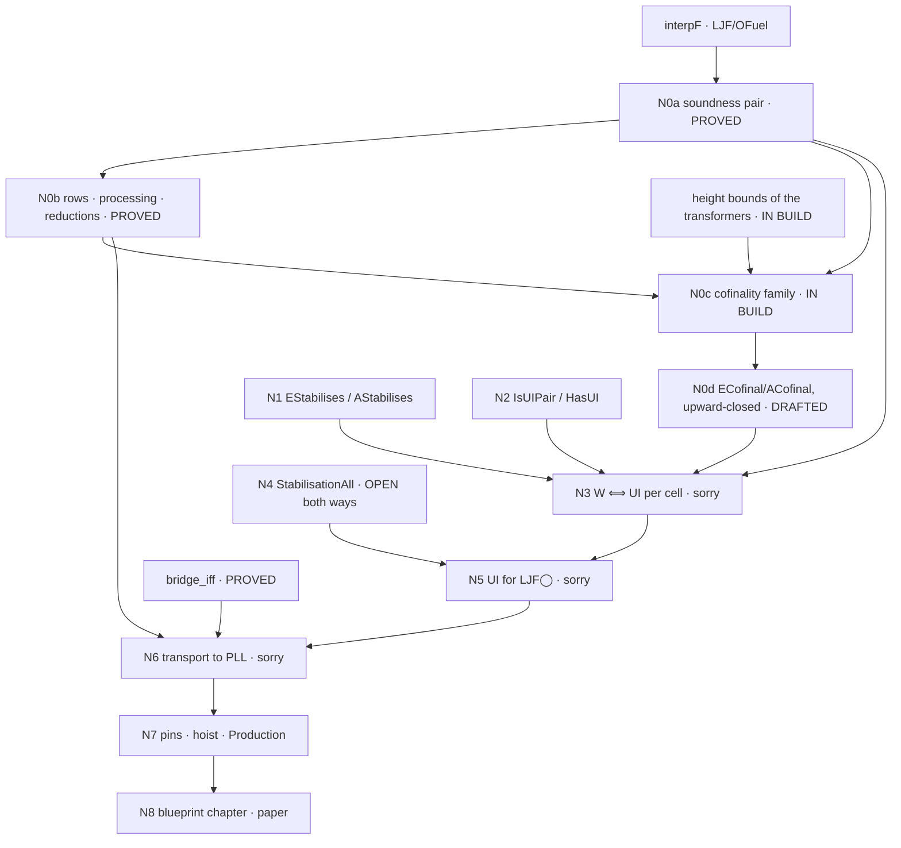

# Route (B) blueprint — uniform interpolation for PLL via the fuel-founded retention interpolant

Drafted 2026-09-05 (Matthew's direction: state the nodes now, with `sorry`
bodies as work in progress, and make the plan a document others can work
from).  Lean source of the nodes: `wip/ui_routeB_blueprint.lean`
(Experimental library only; every `sorry` there is a node to fill, never a
claim).  Evidence base: `docs/ui-ljfo-clause-table.md` §4.7–4.12.

## 0 · How to read and use this

* A **node** is one Lean declaration.  Its **status** is one of
  PROVED (sorry-free, axioms pinned with `#axioms_within`), IN BUILD (an
  agent is producing it now), DRAFTED (statement typed, body `sorry`),
  OPEN (no proof attempted; may be true or false), REFUTED (kernel-checked
  counterexample).  Only PROVED is a result.
* **Edges** are "depends on".  Work on a node only when its inputs are
  PROVED or explicitly assumed as typed hypotheses (the `CimpAnt` idiom:
  `def X : Type := ∀ …` passed as an argument, never a `sorry` in a shared
  module).
* **Sorries live in `wip/` only.**  `lake build Experimental` allows
  `sorryAx`; `lake build Production` forbids it and is the admission gate.
  A node is hoisted out of `wip/` into `LJF/` when its `sorry` is gone
  and its pin holds.
* **Method** (repo `METHOD.md`, `CLAUDE.md`): formal statement first;
  refute before building (the harness of §4.12 is the screen); watch every
  gate fail once; standard proof-theoretic language.
* **Repo mechanics**: work in a worktree; never push `claude/*` branches;
  `scripts/campaign-push.sh frjw-dev` is the only push; `TOOLS.md` before
  reaching for a tool; commit trailers as in `CLAUDE.md`.

## 1 · The aim, in one line

For every PLL formula φ and variable p there are p-free `∃p.φ` and `∀p.φ`
(uniform interpolation, Pitts's sense).  The route: LJF◯'s fuel-founded
retention interpolant `interpF` computes chains `E_f` (descending from ⊤)
and `A_f` (ascending from ⊥); soundness at every fuel is PROVED; cofinality
(every sufficient p-free formula is reached at some fuel) is IN BUILD;
with both, **UI at a cell ⟺ the chains stabilise**; stabilisation at every
cell is THE open theorem; the bridge transports LJF◯ to PLL.

## 2 · Nodes

| id | declaration | file | status | depends on |
|---|---|---|---|---|
| N0a | `eSoundF`, `aSoundF` — soundness at every fuel | `LJF/OFuelSound.lean` | **PROVED** `[propext, Quot.sound]` | `interpF` |
| N0b | row equations at fuel; processing phase `eMinFF`/`aMinFF`; reductions `ecofinalF_of_satE2F`, `acofinalF_of_satA2F`; `cimpAntF_of_satA2F` | `LJF/OFuelMin.lean` | **PROVED** | N0a |
| N0c | `SatE2F`, `SatA2F` — cofinality at a saturated station (the family `TInvF`/`UEntryF`, founded on derivation height) | `LJF/OFuelHeight.lean`, `LJF/OFuelCof.lean` (agent worktree) | **IN BUILD** (base e273a32) | N0a, N0b, height bounds of the transformers |
| N0d | `ECofinalF`, `ACofinalF` (approved statements) and their upward-closed forms `ECofinalUp`, `ACofinalUp` | `wip/ui_routeB_statements.lean`, `wip/ui_routeB_blueprint.lean` | DRAFTED (projections of N0c's `UpFrom` witnesses) | N0c |
| N1 | `EStabilises`, `AStabilises` — the chains eventually constant, the A-side modulo `E_f` | `wip/ui_routeB_blueprint.lean` | DRAFTED (statement) | — |
| N2 | `IsUIPair`, `HasUI` — Pitts's pair for a cell, intrinsic | same | DRAFTED (statement) | — |
| N3 | `hasUI_of_stabilises`, `stabilises_of_hasUI` — W ⟺ UI per cell | same | DRAFTED (`sorry`) | N0a, N0d, N1, N2 |
| N4 | `StabilisationAll` — every saturated cell stabilises | same | **OPEN both ways** (`sorry` placeholder) | — |
| N5 | `ljfo_ui_of_stabilisation` — UI for LJF◯ | same | DRAFTED (`sorry`) | N3, N4 |
| N6 | `IsUIPairPLL`, `PLL_UI`, `pll_ui_of_ljfo` — transport to PLL | same | DRAFTED (`sorry`) | N5, `bridge_iff`, N0b |
| N7 | pins, hoist out of `wip/`, `Production` sweep, `TOOLS.md` | — | — | each node as it lands |
| N8 | blueprint chapter (`LaxBlueprint/`), HANDOFF entry, paper | — | — | N7 |

### The statements (as in the Lean)

    EStabilises p done  :=  Σ f₀, ∀ f ≥ f₀,  E_{f₀} ⊢ E_f  ×  E_f ⊢ E_{f₀}
    AStabilises p done G := Σ f₀, ∀ f ≥ f₀,  E_f, A_{f₀} ⊢ A_f  ×  E_f, A_f ⊢ A_{f₀}

    IsUIPair p done G E A :=
      E, A p-free;  Γ ⊢ E;  (Δ, Γ ⊢ ψ → Δ, E ⊢ ψ)  for p-free Δ, ψ;
      A, Γ ⊢ G;     (Δ, Γ ⊢ G → Δ, E ⊢ A)          for p-free Δ

    N3:  EStabilises × AStabilises  ⟺  HasUI       (given N0a and N0d)
    N4:  ∀ done G, Saturated done → ParkedCtx done → EStabilises × AStabilises
    N6:  PLL_UI := ∀ p φ, Σ E A, IsUIPairPLL p φ E A

`E_f := interpF p f [] done none`, `A_f := interpF p f [] done (some G)`;
`Γ` is the saturated station `done`; goal judgment `tru` (the `lax` case
through `jGoal`).

## 3 · Dependency graph

## 4 · Work packages

**WP1 — N0c (running).**  Refound the minimality family on (derivation
height, goal-free station weight).  Step 0 decides the route: height
bounds for the ten transformers; if `negOfDownStab`/`dykCommute` raise
height, the designed fallback is uniform retention (`interpR`: the
Dyckhoff rows' guards at the full station too), a definition change to be
flagged.  Deliverable: `SatE2F`/`SatA2F` PROVED and pinned, or a typed
obligation with its clause and exercising cell.  Days.

**WP2 — N3.**  Forward: instantiate N0a at the stabilised fuel, minimality
from N0d read at that fuel.  Backward: N0d applied to `E` and to `A`
gives a fuel from which `E_f ⟛ E` and `E_f ∧ A_f ⟛ E_f ∧ A`; needs the
upward-closed form (that is why `UpFrom` was chosen).  Days.

**WP3 — N4, the theorem.**  Proof prong: bound the fuel a cell needs
uniformly over Δ by loop-elimination over the finite state space of
(station, goal) pairs the recursion visits (stations as sets), in the
style of the decider's height bounds (`PLLG4Dec`, the FRJW dichotomy).
The measured constraint: a consequence enters the chain about three times
its derivation height later, one parked-box nesting level per ~10 fuel
units (§4.12).  Refutation prong: a cell whose A-chain ascends without
bound (the Ghilardi–Zawadowski shape); the screen of §4.12 is the harness
(instance screen → chain probe → cofinality instances by the focused
kernel search), and a non-stabilising cell is, with N3, a proof that PLL
lacks UI.  Both outcomes are results.  Unknown duration; the core.

**WP4 — N6.**  Polarise (`negOfO`), take the cell interpolants (E-side of
the station `[negOfO φ]` after processing by `eMinFF`; A-side of the cell
`[] ⇒ negOfO φ`), erase (`eraseNeg`); minimality transports through
`bridge_iff` both ways.  Days.

**WP5 — N7/N8.**  Pins (`#axioms_within`, measured sets), hoist from
`wip/` into `LJF/`, `lake build Production` clean, `TOOLS.md` cells,
HANDOFF §, blueprint chapter, paper.  Ongoing.

## 5 · Evidence that shaped the statements (2026-09-04/05)

* The two earlier "GZ" cells are instance-closed (`∀p` = an instance
  `Γ[χ] ⊃ G[χ]`, χ = ⊥ and χ = s); cofinality validated at both.
* S1 = `[◯(d ⊃ p) ⊃ a, c ⊃ ◯p] ⇒ a` is the first cell no instance closes;
  cofinality validated for Δ = c at station fuel 14 (both sides, also at
  S6 with a Dyckhoff hypothesis and at S7) and for Δ = ◯(c ∨ ¬d) at
  station fuel 22 — each at the fuel the row analysis predicted.  The
  A-side instance for the conjectured `∀p` is a frontier marker (the goal
  outgrows the search), not a failure.
* The first cofinality build stopped at the founding (a cycle at a fixed
  station, §4.11); the height-first order is the one that survives.
* Filter for any refutation candidate: no sufficient p-free instance;
  screen by oracle before measuring a chain.

## 6 · Pointers

`frjw-dev`: e273a32 (record), plus this blueprint.  Files:
`LJF/OFuel.lean`, `LJF/OFuelSound.lean`, `LJF/OFuelMin.lean`,
`wip/ui_routeB_statements.lean`, `wip/ui_routeB_blueprint.lean`,
`wip/ui_retention_cell.lean`, `wip/ui_interpFS.lean`,
`wip/ui_interpFS_run.lean` (`lake exe uifs`), `wip/ui_screen/`.
Record: `docs/ui-ljfo-clause-table.md`, `docs/ljfo-plan.md`,
`docs/next-session.md`.
